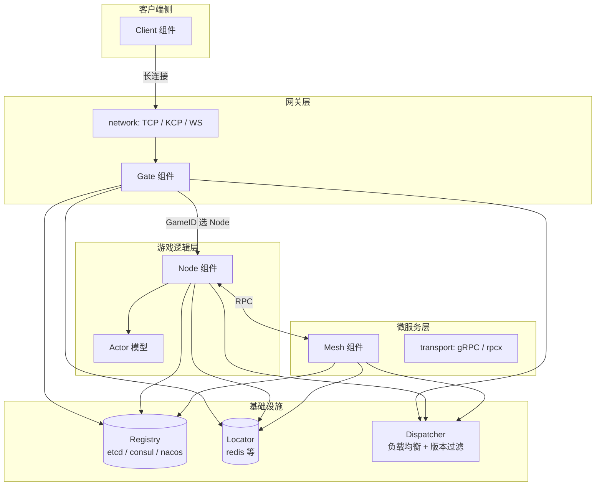

# xbase

xbase 是一套面向游戏与实时业务的 Go 分布式框架。通过 **组件化容器** 组装 Gateway、Node、Mesh 等进程角色，配合 **服务注册**、**用户定位** 与 **两级消息路由**，支持从单机到多机集群的平滑扩展与滚动发布。

---

## 整体架构



**数据流向（玩家消息）：**

```
Client ──TCP/WS/KCP──▶ Gate ──GameID──▶ Node ──MessageID──▶ RouteHandler / Actor
                              │
                              └── Locator 绑定 uid ↔ gate / node
```

---

## 进程角色

| 角色 | 包路径 | 职责 |
|------|--------|------|
| **Gate** | `cluster/gate` | 对外长连接入口；维护 Session；将上行包按 `GameID` 投递到 Node |
| **Node** | `cluster/node` | 游戏逻辑主战场；按 `MessageID` 分发；内置 Actor 调度；可内嵌 Mesh RPC |
| **Mesh** | `cluster/mesh` | 独立微服务进程；对外暴露 gRPC / rpcx；可被 Node / 其他 Mesh 调用 |
| **Client** | `cluster/client` | 框架侧测试/工具客户端；按 `MessageID` 注册本地处理器 |

各角色均实现 `component.Component` 接口，由 `xbase.Container` 统一 `Init → Start → Close → Destroy` 管理生命周期。

---

## 消息模型

统一包结构定义在 `packet/message.go`：

```go
type Message struct {
    Seq       int32  // 序列号
    GameID    int32  // 游戏 ID；0=大厅，非 0=具体游戏；**仅 Gateway 用于选 Node**
    MessageID int32  // 消息 ID；**Node / Client 内业务路由键**
    Buffer    []byte // 业务 payload
}
```

### 两级路由

| 层级 | 路由键 | 发生位置 | 说明 |
|------|--------|----------|------|
| 第一级 | `GameID` | Gate → Node | `NodeLinker.Deliver` 通过 `Dispatcher.FindGameRoute(gameID)` 选目标节点组 |
| 第二级 | `MessageID` | Node / Client | `Router.AddRouteHandler(messageID, handler)` 匹配业务处理器 |

Gate 在 `cluster/gate/proxy.go` 中解包后携带 `message.GameID` 调用 Node；Node 与 Client **不再** 按 GameID 二次选服，只处理 MessageID。

### 有状态 / 无状态路由

Node 路由可附加选项（`cluster/node/router.go`）：

- **Stateful**：用户绑定到固定 Node（通过 Locator 记录 `uid → nid`）
- **Authorized**：集群流转时必须携带 UID；Gate 监听 Node 注册的 `Routes` 元数据，对 `uid==0` 的连接提前拦截
- **Internal**：仅在 Node 间流转，不暴露给客户端

无状态路由走 Dispatcher 负载均衡（random / rr / wrr）；有状态路由优先 `LocateNode`，失败再回退到均衡策略。

---

## 服务注册与发现

`registry.ServiceInstance` 描述一个集群实例：

| 字段 | 含义 |
|------|------|
| `ID` | 实例唯一 ID |
| `Kind` | `gate` / `node` / `mesh` |
| `Alias` | 逻辑组名（同名 Node 构成一组；Gate/Mesh 按 Alias 分组版本） |
| `GameID` | Node 所属游戏（0=大厅） |
| `Version` | 服务版本号（语义化 `x.y.z` 比较） |
| `Endpoint` | 集群内部通信地址 |
| `Events` | Node 订阅的连接事件（Connect / Reconnect / Disconnect） |
| `Routes` | Node 路由元数据（MessageID + Stateful / Authorized / Internal），供 Gate 拦截与集群感知 |
| `State` | work / busy / hang / shut |

注册中心实现：`registry/etcd`、`registry/consul`、`registry/nacos`。

`internal/dispatcher` 监听注册表变更，维护：

- `routes[gameID]` — Node 分组与负载均衡池
- `events[event]` — 事件广播目标
- `endpoints5[insID]` — **全量实例直连表**（含低版本，保障已绑定用户仍可访问旧 Node）

---

## 用户定位（Locator）

`locate.Locator` 维护玩家在线位置：

- `BindGate` / `LocateGate` — 用户 ↔ 网关
- `BindNode` / `LocateNode` — 用户 ↔ 节点（按节点组名 `name`）

Gate 连接建立时绑定 Gate；Node 处理有状态路由时绑定 Node。实现位于 `locate/redis` 等。

Gate / Node 的 Linker 会 `WatchUserLocate`，本地缓存 `sources[uid][group] → insID`，减少定位中心压力。

---

## 版本与滚动发布

Gate、Node、Mesh 均支持：

```go
gate.WithVersion("2")
gate.WithRetireDelay(10 * time.Minute)

node.WithVersion("2")
node.WithRetireDelay(10 * time.Minute)

mesh.WithVersion("2")
mesh.WithRetireDelay(10 * time.Minute)
```

**行为：**

1. 注册时写入 `Version` 到注册中心
2. **新流量**只进入同组最高版本：
   - Node：按 `GameID` 分组取 max version（Dispatcher 负载池过滤）
   - Gate：按 `Alias` 分组
   - Mesh：gRPC / rpcx discovery resolver 过滤低版本实例
3. **已绑定用户**仍可通过 `endpoints5` 直连旧实例，直到 Locator 迁移完成
4. 低版本实例检测到更高版本后，`cluster/versionretire` 等待 `RetireDelay`（默认 10 分钟）再优雅退出

版本比较逻辑：`registry.CompareVersion` / `MaxVersionForGame` / `MaxVersionByKindAlias`。

---

## Node Actor 模型

Node 内置 Actor 调度（`cluster/node/actor.go`）：

- 每个 Actor 拥有独立 mailbox，消息串行处理
- 支持 `Spawn` 子 Actor、`AfterFunc` 定时、`Invoke` 线程安全调用
- Actor 可注册 `MessageID` 级路由，与全局 Router 并存

适用于单玩家/单房间等有状态、需顺序保证的业务单元。

---

## Mesh 微服务

Mesh 通过 `transport` 抽象暴露服务：

```go
// 直连 IP
direct://127.0.0.1:8011

// 直连实例 ID
direct://711baf8d-8a06-11ef-b7df-f4f19e1f0070

// 服务发现（仅最高版本）
discovery://service_name
```

实现：`transport/grpc`、`transport/rpcx`。Resolver 位于 `transport/*/internal/resolver/{discovery,direct}`。

Node 若同时启动 transporter，会在注册中心以 **Mesh Kind** 额外注册一份实例，便于其他进程发现其 RPC 服务。

---

## 集群内部通信

| 模块 | 路径 | 作用 |
|------|------|------|
| Linker | `internal/link` | GateLinker / NodeLinker；封装 Deliver、Trigger、Push 等 |
| Transporter | `internal/transporter` | Gate / Node 之间的二进制协议与连接池 |
| Dispatcher | `internal/dispatcher` | 路由表、事件表、负载均衡、版本过滤 |

Gate 只持有 `NodeLinker`；Node 同时持有 `GateLinker`（下行推送）与 `NodeLinker`（跨 Node / 事件）。

---

## 容器与配置

### Container

```go
container := xbase.NewContainer()
container.Add(gate, node, mesh) // 任意 component.Component
container.Serve()               // Init → Start → 等待信号 → Close → Destroy
```

### 配置分层

| 机制 | 包 | 用途 |
|------|-----|------|
| **etc** | `etc` | 进程启动配置（集群参数、组件注入），只读，来自本地 `./etc` |
| **config** | `config` | 业务动态配置，可接 etcd / consul / nacos / file |

### 集群 etc 配置项

配置写在 `./etc` 目录（或通过环境变量 `DUE_ETC` / 启动参数 `-etc` 指定路径）。下表列出 Gate / Node / Mesh 常用键；未配置时使用括号中的默认值。

#### Gate

| etc 键 | 类型 | 默认值 | 说明 |
|--------|------|--------|------|
| `etc.cluster.gate.id` | string | UUID | 实例 ID |
| `etc.cluster.gate.name` | string | `gate` | 实例名称 / Alias |
| `etc.cluster.gate.addr` | string | `:0` | 集群链路监听地址 |
| `etc.cluster.gate.expose` | bool | `false` | 是否暴露内部通信地址 |
| `etc.cluster.gate.timeout` | duration | `3s` | RPC 调用超时 |
| `etc.cluster.gate.dispatch` | string | `random` | 无状态路由策略：`random` / `rr` / `wrr` |
| `etc.cluster.gate.version` | string | `1` | 服务版本号 |
| `etc.cluster.gate.retireDelay` | duration | `10m` | 低版本实例退出等待时间 |
| `etc.cluster.gate.receiveQueue` | int | `8192` | 收包队列容量；满则关闭连接 |
| `etc.cluster.gate.deliverWorkers` | int | `NumCPU` | 异步 deliver worker 数量 |

代码注入（与 etc 等价）：

```go
gate.WithReceiveQueue(8192)
gate.WithDeliverWorkers(8)
gate.WithVersion("1")
gate.WithRetireDelay(10 * time.Minute)
gate.WithTimeout(3 * time.Second)
```

#### Node

| etc 键 | 类型 | 默认值 | 说明 |
|--------|------|--------|------|
| `etc.cluster.node.id` | string | UUID | 实例 ID |
| `etc.cluster.node.name` | string | `node` | 节点组名（Locator / 路由组 key） |
| `etc.cluster.node.addr` | string | `:0` | 集群链路监听地址 |
| `etc.cluster.node.expose` | bool | `false` | 是否暴露内部通信地址 |
| `etc.cluster.node.codec` | string | `proto` | 编解码器 |
| `etc.cluster.node.weight` | int | `1` | 负载均衡权重 |
| `etc.cluster.node.timeout` | duration | `3s` | RPC 调用超时 |
| `etc.cluster.node.gameID` | int32 | `0` | 游戏 ID（0=大厅） |
| `etc.cluster.node.version` | string | `1` | 服务版本号 |
| `etc.cluster.node.retireDelay` | duration | `10m` | 低版本实例退出等待时间 |
| `etc.cluster.node.requestWorkers` | int | `NumCPU` | 业务消息 dispatch worker 数 |
| `etc.cluster.node.eventWorkers` | int | `2` | 连接事件 dispatch worker 数 |
| `etc.cluster.node.deliverTimeout` | duration | `3s` | 投递 `reqChan` / `evtChan` 超时；满则丢弃 |
| `etc.cluster.node.mailboxTimeout` | duration | `3s` | Actor 邮箱入队超时 |

代码注入：

```go
node.WithGameID(1)
node.WithRequestWorkers(8)
node.WithEventWorkers(2)
node.WithDeliverTimeout(3 * time.Second)
node.WithMailboxTimeout(3 * time.Second)
node.WithVersion("1")
node.WithRetireDelay(10 * time.Minute)
```

#### Mesh

| etc 键 | 类型 | 默认值 | 说明 |
|--------|------|--------|------|
| `etc.cluster.mesh.version` | string | `1` | 服务版本号 |
| `etc.cluster.mesh.retireDelay` | duration | `10m` | 低版本实例退出等待时间 |

### 网络层队列（`network` 包）

TCP / KCP / WS / xgnet 使用统一背压策略，常量定义在 `network/queue.go`：

| 常量 | 默认值 | 行为 |
|------|--------|------|
| `DefaultRecvQueueSize` | `1024` | 收包队列容量；满则**关闭连接** |
| `DefaultWriteQueueSize` | `4096` | 写队列容量 |
| `DefaultWriteEnqueueTimeout` | `3s` | 写队列入队超时；超时则**关闭连接** |

数据路径：`read` 协程只负责解包入队 → `receiveLoop` 调业务回调，避免慢 handler 阻塞 I/O。

### etc 配置示例

```toml
# etc/gate.toml
[cluster.gate]
receiveQueue = 8192
deliverWorkers = 8
version = "1"
retireDelay = "10m"
timeout = "3s"

# etc/node.toml
[cluster.node]
gameID = 1
requestWorkers = 8
eventWorkers = 2
deliverTimeout = "3s"
mailboxTimeout = "3s"
version = "1"
retireDelay = "10m"
```

> 实际键名以 `etc` 包读取为准（如 `etc.cluster.gate.receiveQueue`）；文件组织方式取决于 `./etc` 下的 toml/json 结构。

---

## 目录结构

```
xbase/
├── container.go          # 应用容器入口
├── cluster/              # Gate / Node / Mesh / Client 集群组件
│   └── versionretire/    # 低版本优雅退出
├── component/            # HTTP、pprof 等通用组件
├── internal/
│   ├── dispatcher/       # 路由与负载均衡
│   ├── link/             # 集群互联
│   └── transporter/      # 集群传输协议
├── network/              # TCP / KCP / WS / xgnet
├── packet/               # 消息编解码
├── registry/             # 服务注册发现
├── locate/               # 用户定位
├── session/              # Gate 连接/用户/频道会话
├── transport/            # gRPC / rpcx 微服务传输
├── config/               # 配置中心
├── etc/                  # 启动配置
├── log/                  # 日志
├── cache/ lock/ eventbus/ # 缓存、分布式锁、事件总线
├── crypto/ encoding/     # 加密与序列化
└── utils/                # 工具库
```

---

## 快速上手

```go
package main

import (
    "time"

    "github.com/xbaseio/xbase"
    "github.com/xbaseio/xbase/cluster/gate"
    "github.com/xbaseio/xbase/cluster/node"
    "github.com/xbaseio/xbase/locate/redis"
    "github.com/xbaseio/xbase/registry/consul"
    // ...
)

func main() {
    locator := redis.NewLocator(/* ... */)
    reg := consul.NewRegistry(/* ... */)

    g := gate.NewGate(
        gate.WithLocator(locator),
        gate.WithRegistry(reg),
        gate.WithVersion("1"),
        gate.WithReceiveQueue(8192),
        gate.WithDeliverWorkers(8),
        // gate.WithServer(tcpServer),
    )

    n := node.NewNode(
        node.WithLocator(locator),
        node.WithRegistry(reg),
        node.WithGameID(1),
        node.WithVersion("1"),
        node.WithRequestWorkers(8),
        node.WithDeliverTimeout(3*time.Second),
    )

    n.Proxy().Router().AddRouteHandler(1001, func(ctx node.Context) {
        // 处理 MessageID = 1001
    })

    // 需登录后才能访问的路由
    n.Proxy().Router().AddRouteHandler(2001, loginHandler, node.AuthorizedRoute)

    container := xbase.NewContainer()
    container.Add(g, n)
    container.Serve()
}
```

客户端发送时需设置正确的 `GameID`（Gateway 选 Node）与 `MessageID`（Node 选 Handler）：

```go
msg := &packet.Message{
    GameID:    1,     // 路由到 GameID=1 的 Node 组
    MessageID: 1001,  // Node 内业务处理器
    Buffer:    payload,
}
```

---

## 可插拔能力概览

框架各层均通过接口注入，可按项目替换实现：

| 类别 | 接口 / 包 | 常见实现 |
|------|-----------|----------|
| 网络 | `network` | TCP、KCP、WebSocket |
| 注册 | `registry.Registry` | etcd、Consul、Nacos |
| 定位 | `locate.Locator` | Redis |
| 传输 | `transport` | gRPC、rpcx |
| 配置 | `config` | file、etcd、Consul、Nacos |
| 日志 | `log` | console、file、阿里云、腾讯云 |
| 缓存 | `cache` | Redis、Memcache |
| 锁 | `lock` | Redis、Memcache |
| 事件 | `eventbus` | Redis、NATS、Kafka、RabbitMQ |
| 编解码 | `encoding` | JSON、Protobuf、MsgPack |
| 加密 | `crypto` | RSA、ECC |

---

## 设计要点小结

1. **Gate 管连接，Node 管逻辑，Mesh 管 RPC** — 职责清晰，可独立扩缩容。
2. **GameID 与 MessageID 分离** — 网关只做一次选服，Node 内路由简单稳定。
3. **Locator + Stateful 路由** — 玩家粘滞在固定 Node，支持无缝迁移与踢线。
4. **版本双轨** — 负载均衡走最高版本，直连表保留全量实例，滚动发布不丢在线用户。
5. **组件化容器** — 同一套框架可跑 Gate-only、Node-only、Gate+Node、Mesh 等任意组合。
6. **统一背压** — 网络收包队列 + Gate/Node 异步队列；过载时关连接或丢弃，避免单 goroutine 拖死全链路。
